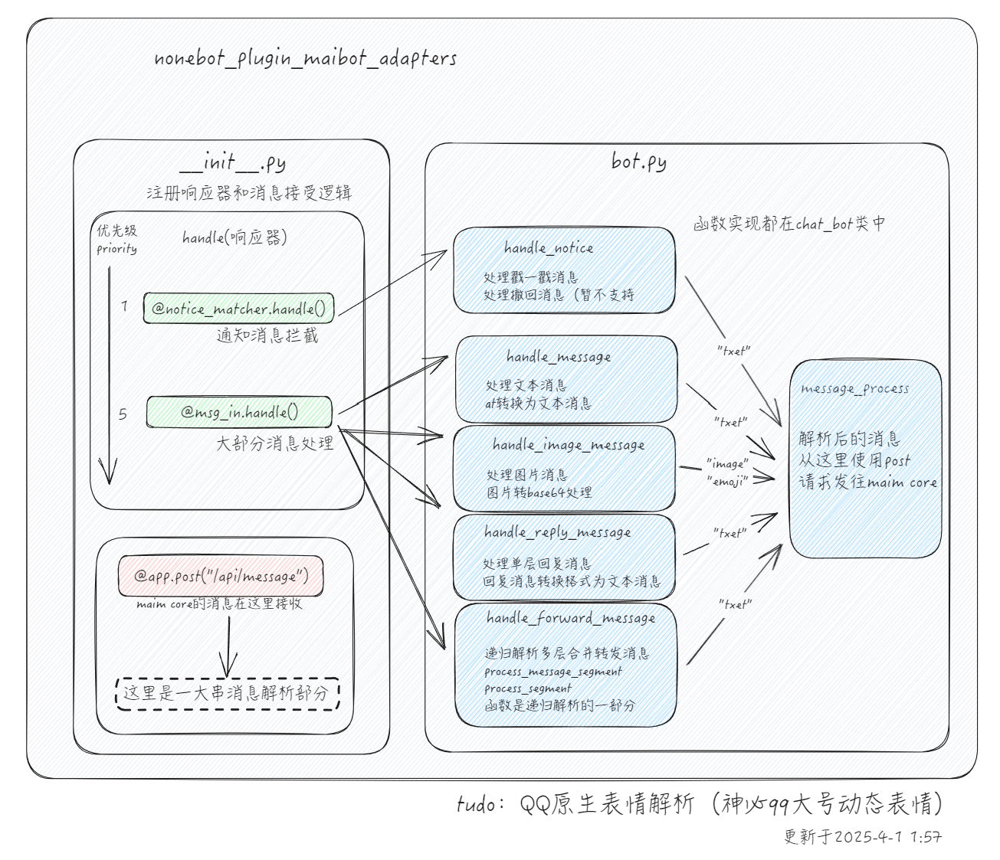

# nb适配器通知
由于本项目仍旧具有一定数量的用户，以及具有一定需求，项目将会重新开始持续维护
## 说明

基于NoneBot（以下简称NB）框架的实现存在以下主要问题：

1. **文档缺失问题**：NB框架的核心文档不完整，关键功能模块缺乏官方说明
2. **部署复杂性**：现有架构存在复杂的依赖关系和环境配置要求
3. **集成难度**：难以将NB框架整合到标准化的一键部署包中
4. **维护成本**：核心文档不完整导致维护成本巨大

## 维护标准

请非开发者以及不具有项目部署经验的用户选择napcat适配器，链接如下
[https://github.com/MaiM-with-u/MaiBot-Napcat-Adapter](https://github.com/MaiM-with-u/MaiBot-Napcat-Adapter)

## 新版本迁移须知
如果你是从旧版本（fastapi连接）更新至最新版本  
请删除或注释掉mmc（麦麦本体）config/config.toml中的  
[platforms]  
nonebot-qq="http://127.0.0.1:18002/api/message" （这一行请删除） 
## 项目架构

没有todo了（